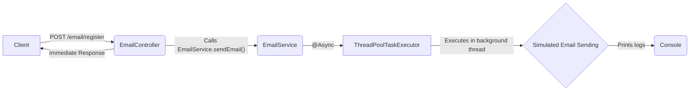

## Async Email Sending Flow – Spring Boot

This diagram illustrates the flow of an asynchronous email sending process in a Spring Boot application.


### Explanation

- **Client** sends a POST request to `/email/register`.
- **EmailController** receives the request and calls `EmailService.sendEmail()`.
- The `sendEmail()` method is annotated with `@Async`, so it runs in a separate thread managed by the custom executor.
- **EmailAsyncConfig** defines a `ThreadPoolTaskExecutor` controlling how many background threads are used.
- The actual email sending is simulated (with delay and print statements) and does not block the main thread.
- The controller immediately sends a response back to the client while the email is sent asynchronously.
- This approach improves responsiveness and scalability of your application.

## Swagger / OpenAPI Integration

### How to Access Swagger UI

After running the Spring Boot application locally, open your browser and navigate to:

```
http://localhost:8080/swagger-ui/index.html
```
## Logging Configuration Summary

- **Log Pattern:**  
  `%d{dd-MM-yyyy HH:mm:ss} [%thread] %-5level %logger{36} - %msg%n`

- **Console Appender:**  
  Logs output to console using the defined log pattern.

- **Rolling File Appender:**  
  - Logs saved in `logs/app.log`  
  - Daily rollover: `logs/app-YYYY-MM-DD.log`  
  - Retain logs for 30 days (`maxHistory=30`)

- **Root Logger Level:** `INFO` (logs INFO and above)

## Note for Spring Boot (Higher Versions)

In newer Spring Boot versions, you can define the console log pattern directly in `application.yml` or `application.properties` like this. However, `logback_spring.xml` is still used for more complex configurations like rolling files.
```yaml

logging:
  pattern:
    console: '%d{dd-MM-yyyy HH:mm:ss} [%thread] %-5level %logger{36} - %msg%n'
  file:
    name: logs/app.log
  level:
    root: INFO
```
---

This setup enables daily rotated logs with console and file output, ensuring manageable log files and easy debugging.

## Rate Limiting Configuration Using Resilience4j

- Added the `RateLimiting` using Resilience4j in the `EmailService` class. The rate limiting is configured to allow 2 requests per period of 60 seconds with a timeout duration of 0 seconds.
- Refer to the `EmailService` class and `application.properties` for the implementation details.
- Another way to implement rate limiting is by using `Bucket4j`, which allows configuration based on IP address or globally. In contrast, `Resilience4j` does not support IP-based rate limiting out of the box.

## Rate Limiting Configuration Using Bucket4j

- Uses Redis to store and manage rate limit buckets.
- Each client IP gets its own bucket (per-IP rate limiting).
- Limit is 5 requests per minute per IP.
- Buckets are removed from Redis after 10 minutes of inactivity.
- Configuration is in `RateLimiterBucket4jConfig.java`.
- Service logic is in `RateLimitBucket4jService.java`.
- Global rate limiting is enforced using `RateLimitFilter.java`, which intercepts incoming requests and applies rate limiting based on the client IP address. If you do not want to apply rate limiting globally, remove the logic inside the `doFilter` method of `RateLimitFilter.java` and implement it as a separate method.
- Example endpoint: `/email/testRateLimitBucket4j` in `EmailController`.

## ✅ Progress Tracker

Here’s a summary of the tasks that have been successfully completed:

- [✅] Async Email Sending Flow .
- [✅] Swagger / OpenAPI Integration. (In Async-impl)
- [✅] Custom Logging Configuration. (In Async-impl)
- [✅] Rate Limiting Configuration Using Resilience4j. (In Async-impl)
- [✅] Rate Limiting Configuration Using Bucket4j.(In Async-impl)