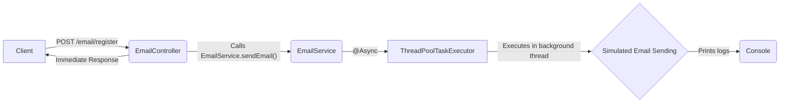

## Async Email Sending Flow – Spring Boot

This diagram illustrates the flow of an asynchronous email sending process in a Spring Boot application.


### Explanation

- **Client** sends a POST request to `/email/register`.
- **EmailController** receives the request and calls `EmailService.sendEmail()`.
- The `sendEmail()` method is annotated with `@Async`, so it runs in a separate thread managed by the custom executor.
- **EmailAsyncConfig** defines a `ThreadPoolTaskExecutor` controlling how many background threads are used.
- The actual email sending is simulated (with delay and print statements) and does not block the main thread.
- The controller immediately sends a response back to the client while the email is sent asynchronously.
- This approach improves responsiveness and scalability of your application.

## Swagger / OpenAPI Integration

### How to Access Swagger UI

After running the Spring Boot application locally, open your browser and navigate to:

```
http://localhost:8080/swagger-ui/index.html
```

## ✅ Progress Tracker

Here’s a summary of the tasks that have been successfully completed:

- [✅] Async Email Sending Flow .
- [✅] Swagger / OpenAPI Integration. (In Async-impl)